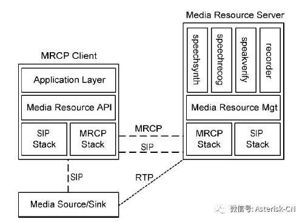
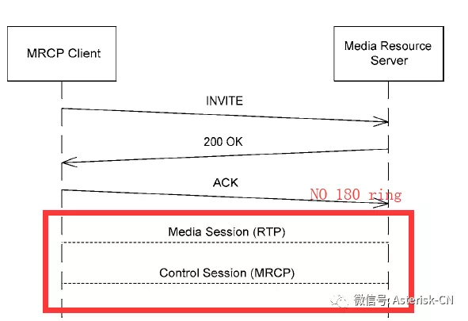

# unimrcp 抓包分析



操作步骤
```
1. 下载unimrcp代码
$ git clone https://github.com/unispeech/unimrcp.git

2. 编译安装至install目录下
$ ./bootstrap
$ ./configure --prefix=$(pwd)/../install
$ make && make install

3. 进入install/bin 目录

4.打开三个控制台，分别执行 ./unimrcpclient ./unimrcpserver，第三个控制台输入抓包命令：tcpdump -i lo -w mrcp.pcap 开始抓包

5.在执行unimrcpclient所在控制台按一下回车，输入run recog，回车
# 看到如下信息表示mrcp客户端访问服务端成功
$ 2020-06-11 14:30:40:791479 [INFO]   Start Task [MRCP Client]
$ 2020-06-11 14:30:40:791588 [NOTICE] Run Demo Framework
$ 2020-06-11 14:30:40:791610 [INFO]   Start Task [SIP-Agent-1]
$ 2020-06-11 14:30:40:791720 [INFO]   Start Task [RTSP-Agent-1]
$ 2020-06-11 14:30:40:791779 [INFO]   Start Task [MRCPv2-Agent-1]
$ 2020-06-11 14:30:40:792016 [INFO]   Start Task [Media-Engine-1]
$ 2020-06-11 14:30:40:793470 [NOTICE] MRCP Client Started
$ >
$ >run recog
$ >2020-06-11 14:31:10:193439 [NOTICE] Run Demo Application Scenario [recog]
$ 2020-06-11 14:31:10:193560 [NOTICE] Create MRCP Handle 0x7fd198000a88 [uni2]
$ 2020-06-11 14:31:10:193592 [INFO]   Create Channel 0x7fd198000a88 <new>
$ 2020-06-11 14:31:10:193674 [INFO]   Receive App Request 0x7fd198000a88 <new> [2]
$ 2020-06-11 14:31:10:193791 [INFO]   Add MRCP Handle 0x7fd198000a88 <new>
$ 2020-06-11 14:31:10:193851 [NOTICE] Add Control Channel 0x7fd198000a88 <new@speechrecog>
$ 2020-06-11 14:31:10:202532 [INFO]   Send Offer 0x7fd198000a88 <new> [c:1 a:1 v:0] to 127.0.0.1:8060
$ 2020-06-11 14:31:10:202582 [INFO]   Local SDP 0x7fd198000a88 <new>

6.使用wireshark 打开mrcp.pcap
```
## Sip协议(基于udp)


### 1. 新建sip会话
```
# <client to server>
INVITE sip:127.0.0.1:8060 SIP/2.0 
Via: SIP/2.0/UDP 127.0.0.1:8062;rport;branch=z9hG4bK9ag286tp2Fy8H 
Max-Forwards: 70 
From: <sip:127.0.0.1:8062>;tag=y5tNvycgavK2D 
To: <sip:127.0.0.1:8060> 
Call-ID: 20ed5309-2622-1239-53be-d0946663da71 
CSeq: 950192259 INVITE 
Contact: <sip:127.0.0.1:8062;transport=udp> 
User-Agent: UniMRCP SofiaSIP 1.5.0 
Allow: INVITE, ACK, BYE, CANCEL, OPTIONS, PRACK, MESSAGE, SUBSCRIBE, NOTIFY, REFER, UPDATE 
Supported: timer, 100rel 
Content-Type: application/sdp 
Content-Disposition: session 
Content-Length: 396 
 
v=0 
o=UniMRCPClient 1720305897758526019 6204858252718440444 IN IP4 192.168.1.75 
s=- 
c=IN IP4 127.0.0.1 
t=0 0 
m=application 9 TCP/MRCPv2 1 
a=setup:active 
a=connection:new 
a=resource:speechrecog 
a=cmid:1 
m=audio 4008 RTP/AVP 0 8 96 101 
a=rtpmap:0 PCMU/8000 
a=rtpmap:8 PCMA/8000 
a=rtpmap:96 L16/8000 
a=rtpmap:101 telephone-event/8000 
a=fmtp:101 0-15 
a=sendonly 
a=ptime:20 
a=mid:1 

# <server to client>
SIP/2.0 100 Trying 
Via: SIP/2.0/UDP 127.0.0.1:8062;rport=8062;branch=z9hG4bK9ag286tp2Fy8H 
From: <sip:127.0.0.1:8062>;tag=y5tNvycgavK2D 
To: <sip:127.0.0.1:8060> 
Call-ID: 20ed5309-2622-1239-53be-d0946663da71 
CSeq: 950192259 INVITE 
User-Agent: UniMRCP SofiaSIP 1.5.0 
Content-Length: 0

# <server to client>
SIP/2.0 200 OK 
Via: SIP/2.0/UDP 127.0.0.1:8062;rport=8062;branch=z9hG4bK9ag286tp2Fy8H 
From: <sip:127.0.0.1:8062>;tag=y5tNvycgavK2D 
To: <sip:127.0.0.1:8060>;tag=yyt35B6vUSacp 
Call-ID: 20ed5309-2622-1239-53be-d0946663da71 
CSeq: 950192259 INVITE 
Contact: <sip:127.0.0.1:8060> 
User-Agent: UniMRCP SofiaSIP 1.5.0 
Accept: application/sdp 
Allow: INVITE, ACK, BYE, CANCEL, OPTIONS, PRACK, MESSAGE, SUBSCRIBE, NOTIFY, REFER, UPDATE 
Supported: timer, 100rel 
Session-Expires: 600;refresher=uac 
Min-SE: 120 
Content-Type: application/sdp 
Content-Disposition: session 
Content-Length: 367 
 
v=0 
o=UniMRCPServer 3733880930653100872 8063778474942508652 IN IP4 192.168.1.75 
s=- 
c=IN IP4 127.0.0.1 
t=0 0 

m=application 1544 TCP/MRCPv2 1 //server端mrcp端口
a=setup:passive 
a=connection:new 
a=channel:498fa70eab7f11ea@speechrecog 
a=cmid:1 

m=audio 5006 RTP/AVP 0 101 // server端rtp流端口
a=rtpmap:0 PCMU/8000 
a=rtpmap:101 telephone-event/8000 
a=fmtp:101 0-15 
a=recvonly 
a=ptime:20 
a=mid:1 

# <client to server>
ACK sip:127.0.0.1:8060 SIP/2.0 
Via: SIP/2.0/UDP 127.0.0.1:8062;rport;branch=z9hG4bKam9ta2BtZrmUD 
Max-Forwards: 70 
From: <sip:127.0.0.1:8062>;tag=y5tNvycgavK2D 
To: <sip:127.0.0.1:8060>;tag=yyt35B6vUSacp 
Call-ID: 20ed5309-2622-1239-53be-d0946663da71 
CSeq: 950192259 ACK 
Content-Length: 0 
```

### 2. 结束sip会话

```
# <client to server>
INVITE sip:127.0.0.1:8060 SIP/2.0 
Via: SIP/2.0/UDP 127.0.0.1:8062;rport;branch=z9hG4bKBX2KcXvXv1aeS 
Max-Forwards: 70 
From: <sip:127.0.0.1:8062>;tag=y5tNvycgavK2D 
To: <sip:127.0.0.1:8060>;tag=yyt35B6vUSacp 
Call-ID: 20ed5309-2622-1239-53be-d0946663da71 
CSeq: 950192260 INVITE 
Contact: <sip:127.0.0.1:8062;transport=udp> 
User-Agent: UniMRCP SofiaSIP 1.5.0 
Allow: INVITE, ACK, BYE, CANCEL, OPTIONS, PRACK, MESSAGE, SUBSCRIBE, NOTIFY, REFER, UPDATE 
Supported: timer, 100rel 
Session-Expires: 600;refresher=uac 
Min-SE: 120 
Content-Type: application/sdp 
Content-Disposition: session 
Content-Length: 209 
 
v=0 
o=UniMRCPClient 1720305897758526019 6204858252718440446 IN IP4 192.168.1.75 
s=- 
c=IN IP4 127.0.0.1 
t=0 0 
m=application 0 TCP/MRCPv2 1 
a=resource:speechrecog 
a=cmid:1 
m=audio 0 RTP/AVP 19 
a=mid:1 

# <server to client>
SIP/2.0 100 Trying 
Via: SIP/2.0/UDP 127.0.0.1:8062;rport=8062;branch=z9hG4bKBX2KcXvXv1aeS 
From: <sip:127.0.0.1:8062>;tag=y5tNvycgavK2D 
To: <sip:127.0.0.1:8060>;tag=yyt35B6vUSacp 
Call-ID: 20ed5309-2622-1239-53be-d0946663da71 
CSeq: 950192260 INVITE 
User-Agent: UniMRCP SofiaSIP 1.5.0 
Content-Length: 0 

# <server to client>
SIP/2.0 200 OK 
Via: SIP/2.0/UDP 127.0.0.1:8062;rport=8062;branch=z9hG4bKBX2KcXvXv1aeS 
From: <sip:127.0.0.1:8062>;tag=y5tNvycgavK2D 
To: <sip:127.0.0.1:8060>;tag=yyt35B6vUSacp 
Call-ID: 20ed5309-2622-1239-53be-d0946663da71 
CSeq: 950192260 INVITE 
Contact: <sip:127.0.0.1:8060> 
User-Agent: UniMRCP SofiaSIP 1.5.0 
Accept: application/sdp 
Allow: INVITE, ACK, BYE, CANCEL, OPTIONS, PRACK, MESSAGE, SUBSCRIBE, NOTIFY, REFER, UPDATE 
Supported: timer, 100rel 
Session-Expires: 600;refresher=uac 
Min-SE: 120 
Content-Type: application/sdp 
Content-Disposition: session 
Content-Length: 167 
 
v=0 
o=UniMRCPServer 3733880930653100872 8063778474942508653 IN IP4 192.168.1.75 
s=- 
c=IN IP4 127.0.0.1 
t=0 0 
m=application 0 TCP/MRCPv2 19 
m=audio 0 RTP/AVP 19 

# <client to server>
BYE sip:127.0.0.1:8060 SIP/2.0 
Via: SIP/2.0/UDP 127.0.0.1:8062;rport;branch=z9hG4bKDFN5FKy4pKQKg 
Max-Forwards: 70 
From: <sip:127.0.0.1:8062>;tag=y5tNvycgavK2D 
To: <sip:127.0.0.1:8060>;tag=yyt35B6vUSacp 
Call-ID: 20ed5309-2622-1239-53be-d0946663da71 
CSeq: 950192261 BYE 
User-Agent: UniMRCP SofiaSIP 1.5.0 
Allow: INVITE, ACK, BYE, CANCEL, OPTIONS, PRACK, MESSAGE, SUBSCRIBE, NOTIFY, REFER, UPDATE 
Supported: timer, 100rel 
Content-Length: 0 

# <server to client>
SIP/2.0 200 OK 
Via: SIP/2.0/UDP 127.0.0.1:8062;rport=8062;branch=z9hG4bKDFN5FKy4pKQKg 
From: <sip:127.0.0.1:8062>;tag=y5tNvycgavK2D 
To: <sip:127.0.0.1:8060>;tag=yyt35B6vUSacp 
Call-ID: 20ed5309-2622-1239-53be-d0946663da71 
CSeq: 950192261 BYE 
User-Agent: UniMRCP SofiaSIP 1.5.0 
Allow: INVITE, ACK, BYE, CANCEL, OPTIONS, PRACK, MESSAGE, SUBSCRIBE, NOTIFY, REFER, UPDATE 
Supported: timer, 100rel 
Content-Length: 0 
```

## Mrcp协议(基于tcp)

### tcp三次握手(建立连接)
```
1. 第 1 次握手建立连接时，客户端向服务器发送 SYN 报文（SEQ=x，SYN=1），并进入 SYN_SENT 状态

2. 第 2 次握手分两部分来完成的，即 SYN+ACK（请求和确认）报文。
     服务器收到了客户端的请求，向客户端回复一个确认信息（ACK=x+1）。
     服务器再向客户端发送一个 SYN 包（SEQ=y）建立连接的请求，此时服务器进入 SYN_RECV 状态

3. 第 3 次握手，是客户端收到服务器的回复（SYN+ACK 报文）。此时，客户端也要向服务器发送确认包（ACK）
```
### mrcp控制会话
```
<client to server>
MRCP/2.0 448 DEFINE-GRAMMAR 1
Channel-Identifier: 498fa70eab7f11ea@speechrecog
Content-Type: application/srgs+xml
Content-Id: request1@form-level.store
Content-Length: 269

<?xml version="1.0"?>
<grammar xmlns="http://www.w3.org/2001/06/grammar" xml:lang="en-US" version="1.0" mode="voice" root="digit">
  <rule id="digit">
    <one-of>
      <item>one</item>
      <item>two</item>
      <item>three</item>
    </one-of>
  </rule>
</grammar>

<server to client>
MRCP/2.0 112 1 200 COMPLETE
Channel-Identifier: 498fa70eab7f11ea@speechrecog
Completion-Cause: 000 success

<client to server>
MRCP/2.0 290 RECOGNIZE 2 
Channel-Identifier: 498fa70eab7f11ea@speechrecog 
Content-Type: text/uri-list 
Cancel-If-Queue: false 
No-Input-Timeout: 5000 
Recognition-Timeout: 10000 
Start-Input-Timers: true 
Confidence-Threshold: 0.87 
Content-Length: 33 
 
session:request1@form-level.store

<server to client>
MRCP/2.0 83 2 200 IN-PROGRESS
Channel-Identifier: 498fa70eab7f11ea@speechrecog

<server to client>
MRCP/2.0 94 START-OF-INPUT 2 IN-PROGRESS
Channel-Identifier: 498fa70eab7f11ea@speechrecog

<server to client>
MRCP/2.0 393 RECOGNITION-COMPLETE 2 COMPLETE
Channel-Identifier: 498fa70eab7f11ea@speechrecog
Completion-Cause: 000 success
Content-Type: application/x-nlsml
Content-Length: 208

<?xml version="1.0"?>
<result> 
  <interpretation grammar="session:request1@form-level.store" confidence="0.97">
    <instance>one</instance>
    <input mode="speech">one</input>
  </interpretation>
</result>
```

### tcp四次挥手(断开连接)
```
1. 第一次挥手：Client发送一个FIN，用来关闭Client到Server的数据传送，Client进入FIN_WAIT_1状态

2. 第二次挥手：Server收到FIN后，发送一个ACK给Client，确认序号为收到序号+1（与SYN相同，一个FIN占用一个序号），Server进入CLOSE_WAIT状态

3. 第三次挥手：Server发送一个FIN，用来关闭Server到Client的数据传送，Server进入LAST_ACK状态

4. 第四次挥手：Client收到FIN后，Client进入TIME_WAIT状态，接着发送一个ACK给Server，确认序号为收到序号+1，Server进入CLOSED状态，完成四次挥手
```

## rtp协议(基于udp)

rtp实时流传输端口由server端通过sip协议给到client端

## 附录：参考抓包命令
```
# 抓取本地回环地址
tcpdump -i lo -w mrcp.cap
```

